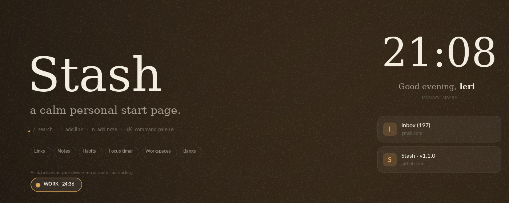

# Stash — New Tab

**A calm personal start page for Chrome.**

Links, folders, notes, habits, a focus timer, weather, a command palette, and workspaces — all in one quiet place.
**All local, no account, no tracking.**

 

 

[**Install from Chrome Web Store →**](https://chromewebstore.google.com/detail/stash-%E2%80%94-new-tab/bbpffiialamfnlcpipefcofohegcheji)

 

 

## ✨ Features

<table>
<tr>
<td width="50%" valign="top">

### 🔗 Links & folders

Save links with categories, pin favorites, sort by manual / alphabetical / most-clicked / unread-first. Organize into **folders** with custom emoji icons — folders open in a clean modal so you don't lose your place. Reading-list tracking: new links are unread until clicked.

</td>
<td width="50%" valign="top">

### 📝 Notes & tasks

Markdown supported: **bold**, *italic*, `code`, [links](#), `- lists`, hashtags, and clickable inline `[ ]` checkboxes. Six per-note colors, three built-in templates (Daily journal / Meeting notes / Weekly review), drag to reorder, right-click for actions.

</td>
</tr>
<tr>
<td width="50%" valign="top">

### 🌱 Habits

Daily, weekdays, weekends, M·W·F, or T·T·S schedules — streaks only count scheduled days. Set goal streaks with a progress ring. GitHub-style **year heatmap** shows your full habit history at a glance.

</td>
<td width="50%" valign="top">

### 🍅 Focus timer

Floating Pomodoro pill with a smooth progress ring around its border. Customizable work / break minutes. Four ambient end-sounds. **Runs in the background** even when the new tab is closed, with desktop notifications.

</td>
</tr>
<tr>
<td width="50%" valign="top">

### 🔍 Search done right

Type to filter live. Prefix `/word` for local search across links/notes/habits. Type `= 24 * 7` for instant math (sqrt, sin, log, π, e, parens, powers). Define **custom bangs** — `y! cats` for YouTube, `gh! react` for GitHub.

</td>
<td width="50%" valign="top">

### 🗂 Workspaces

Switch between Personal, Work, or any number of separate stashes with one click. Each workspace has its own links, folders, notes, habits, AND theme — flip the entire vibe just by switching.

</td>
</tr>
</table>

 

### 🎨 Make it yours

- **Six theme presets** — Library, Ocean, Forest, Dusk, Sand, Paper (dark and light)
- **Six accent colors**, three card sizes, three container widths
- Animated drift background, custom background image upload
- Drag-reorder every section on the page
- 12 / 24 hour time format, or auto

### 🧰 The little extras

- 🌤 Optional weather widget (Open-Meteo · no API key)
- 🎯 "What's your focus today?" prompt that resets at midnight
- 📅 Countdown to any date — vacation, deadline, birthday
- 💬 Daily quote from a curated collection
- 🌐 Top sites + Recently closed tabs (optional, opt-in)
- 📊 Weekly stats with **trend lines vs last week** + all-time focus stats
- 💾 JSON backup & import to move between devices

 

## ⌨️ Keyboard shortcuts

| Key | Action |
|:---:|:---|
| `⌘K` / `Ctrl+K` | Open command palette |
| `/` | Focus search bar |
| `l` | Add a link |
| `n` | Add a note |
| `h` | Add a habit |
| `t` | Start / stop focus timer |
| `Esc` | Close any open panel |
| **Right-click** | Context menu on any card |

In the **command palette**, type to fuzzy-search across all your links, notes, categories, Chrome bookmarks, and built-in actions.

In the **search bar**:

| Type | Result |
|:---|:---|
| `something` | Filter your stash (when engine = Stash) or send to selected engine on Enter |
| `/word` | Always search locally, even with a web engine selected |
| `= 24 * 7` | Live math result — Enter to copy |
| `y! cats` | Search YouTube (define your own bangs) |
| `gh! react` | Search GitHub |
| `w! einstein` | Search Wikipedia |

 

## 🔒 Privacy

**Your data never leaves your device.** Everything is stored locally via `chrome.storage.local`.

- 🚫 No account, no sign-in, no email collected
- 🚫 No analytics, telemetry, or tracking
- 🚫 No advertisements
- 🚫 No remote code execution (math parser is hand-written, not `eval`)
- ✅ One optional outbound request: if you enable the weather widget, Stash fetches your city's current conditions from [Open-Meteo](https://open-meteo.com) (free, no key)

Full details in the [**Privacy Policy**](https://sokhadze.github.io/stash-legal/privacy.html).

### Permissions used (and why)

| Permission | What it's for |
|:---|:---|
| `storage` | Saves your links, notes, habits, and settings locally |
| `favicon` | Shows site icons next to links — pulled from Chrome's local cache |
| `topSites` | **Optional** "Top sites" section showing your most-visited Chrome sites |
| `bookmarks` | Command palette can find matching Chrome bookmarks |
| `sessions` | **Optional** "Recently closed tabs" section |
| `tabs` | The toolbar popup reads the active tab's URL/title to pre-fill "Add to Stash" |
| `alarms` | Background focus timer — keeps ticking when the new tab is closed |
| `notifications` | Desktop notifications when a focus phase ends |

 

## 📦 Install

### From the Chrome Web Store *(recommended)*

[**Click here to install →**](https://chromewebstore.google.com/detail/stash-%E2%80%94-new-tab/bbpffiialamfnlcpipefcofohegcheji)

 

## 🙏 Credits

Built with 💛 by [Lery](mailto:lerisokhadze@gmail.com). 

 

**Stash · all data stays on your device**

⭐ Star this repo if Stash improves your day.

